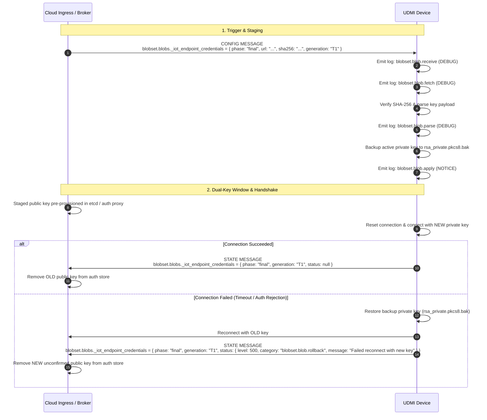

[**UDMI**](../../) / [**Docs**](../) / [**Specs**](./) / [Key Rotation](#)

# Key Rotation Specification

The _Key Rotation API_ defines a standard, zero-downtime mechanism for cycling device-to-cloud authentication credentials (e.g., RSA/EC public-private keypairs, X.509 certificates) used for MQTT connections to cloud IoT brokers and ingress auth proxies.

---

## 1. Architecture & Multi-Key Handover

To eliminate downtime and prevent device lockouts, key rotation uses a multi-key grace period:

1. **Pre-provisioning:** The new public key is registered in the cloud auth store (e.g. `etcd` / Site Model / cloud auth proxy) alongside the currently active key. Both keys remain valid during the rotation window.
2. **Delivery & Handshake:** The cloud initiates key rotation by configuring the `_iot_endpoint_credentials` blob within the `blobset` configuration block.
3. **Backup & Activation:** The device backs up its active private key (`rsa_private.pkcs8.bak`), activates the new keypair, and reconnects to the broker.
4. **Finalization or Rollback:**
   - **Success (Finalization):** When the device successfully reconnects using the new key, it reports `phase: final` with an empty (successful) status in its `blobset` state. The cloud then prunes the old public key from the auth store.
   - **Failure (Rollback):** If the device fails to connect with the new key (e.g., due to TLS rejection or network failure), it restores its backup private key, reconnects using the old key, and reports `phase: final` with an error status (`blobset.blob.rollback`). The cloud then prunes the unconfirmed new public key from the auth store.

---

## 2. Sequence Flow



---

## 3. Schemas & Data Formats

### 3.1 Predefined Blobset Identifier
The `blobsets` enum in [`schema/common.json`](../../schema/common.json) includes `_iot_endpoint_credentials` for credential and key rotation management.

### 3.2 Configuration Payload
Key delivery utilizes standard data URIs (e.g. `data:application/json;base64,...`) or HTTPS URLs containing the credentials specification.

To ensure end-to-end confidentiality of private keys against intermediate broker/network eavesdropping, credentials payloads support **Asymmetric Envelope Encryption** (using `RSA-OAEP-256` for RSA keys or `ECDH-ES+A256GCM` for EC keys):

```json
{
  "key_format": "RS256",
  "encryption": {
    "algorithm": "RSA-OAEP-256",
    "ciphertext": "..."
  }
}
```

For development or unencrypted lab environments, plaintext `key_data` (Base64-encoded PKCS#8 or PEM) is also accepted:

```json
{
  "key_format": "RS256",
  "key_data": "MIIEvgIBADANBgkqhkiG9w0BAQEFAASCBKgwggSkAgEAAoIBAQC..."
}
```

The cloud packages this payload into the `_iot_endpoint_credentials` blob:

```json
{
  "blobset": {
    "blobs": {
      "_iot_endpoint_credentials": {
        "phase": "final",
        "url": "data:application/json;base64,eyJrZXlfZm9ybWF0IjoiUlMyNTYiLCJlbmNyeXB0aW9uIjp7ImFsZ29yaXRobSI6IlJTQS1PQUVQLTI1NiIsImNpcGhlcnRleHQiOiIuLi4ifX0=",
        "sha256": "4b227777d4dd1fc61c6f884f48641d02b4d121d3fd328cb08b5531fcacdabf8a",
        "generation": "2026-08-24T12:00:00.000Z"
      }
    }
  }
}
```

### 3.3 State Reporting
Upon completion of rotation (or rollback), the device publishes its `blobset` state:

```json
{
  "blobset": {
    "blobs": {
      "_iot_endpoint_credentials": {
        "phase": "final",
        "generation": "2026-08-24T12:00:00.000Z"
      }
    }
  }
}
```

---

## 4. Error Handling & Observability

Devices emit standard hierarchical log categories throughout the rotation sequence:

| Category | Level | Description |
| :--- | :--- | :--- |
| **`blobset.blob.receive`** | `DEBUG` | Key rotation config received from cloud. |
| **`blobset.blob.fetch`** | `DEBUG`/`ERROR` | Fetching/decoding the key payload from `url`. |
| **`blobset.blob.parse`** | `DEBUG`/`ERROR` | Verifying SHA-256 hash and parsing key format. |
| **`blobset.blob.apply`** | `NOTICE`/`ERROR`| Backing up old key, installing new key, and attempting reconnect. |
| **`blobset.blob.rollback`** | `NOTICE`/`ERROR`| Connection failed with new key; restored backup key and reconnected. |
