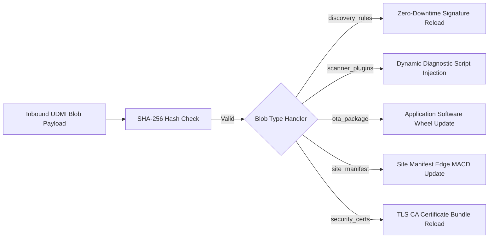
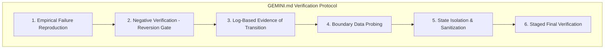
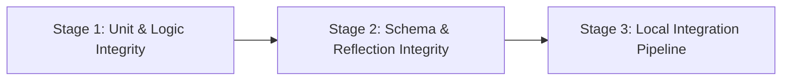

# UDMI Spotter Node: Detailed Implementation & Technical Parity Plan

## Executive Summary

This document outlines the phase-by-phase implementation plan for the **UDMI Spotter Node** ([go/tdd:spotter](http://goto.google.com/tdd:spotter)). Spotter is a production-grade, Python-based reference client and active discovery/diagnostic agent within the Universal Device Management Interface (UDMI) ecosystem.

Spotter replaces legacy discovery implementations with a modular, extensible architecture built directly upon the Python core client library [edge/clientlib/python](../clientlib/python/README.md). Rather than duplicating data models or re-implementing custom protocol structures, Spotter natively imports and leverages core clientlib abstractions from [udmi.core](../clientlib/python/src/udmi/core/__init__.py). All behavioral parity requirements are mapped directly to the functional specification documented in [misc/discoverynode/discoverynode.md](../../misc/discoverynode/discoverynode.md).

This plan strictly specifies software behavior, integration mechanics, testing strategies, parity validation frameworks, and operational verification protocols. **All implementation source code and legacy source code references are explicitly excluded from this specification.**

---

## Phase Roadmap Overview

```mermaid
graph TD
    subgraph Phase 1: MVP Parity & Core Discovery Engine
        P1_1[Sub-phase 1.1: Core Architecture & Orchestrator]
        P1_2[Sub-phase 1.2: Active Discovery Providers - BACnet & IP]
        P1_3[Sub-phase 1.3: Legacy Differential Parity Suite]
        P1_1 --> P1_2 --> P1_3
    end

    subgraph Phase 2: Diagnostics, Ephemeral PCAP & GOB Integration
        P2_1[Sub-phase 2.1: Ephemeral Remote PCAP Engine]
        P2_2[Sub-phase 2.2: Fieldbus Quality & Passive ARP]
        P2_3[Sub-phase 2.3: Edge MACD & GOB Stream]
        P1_3 --> P2_1 --> P2_2 --> P2_3
    end

    subgraph Phase 3: UDMI Test Cadre, OTA Engine & Gateway
        P3_1[Sub-phase 3.1: Test Cadre - ATN & DUT Modes]
        P3_2[Sub-phase 3.2: 5-Type Blobset OTA Lifecycle Engine]
        P3_3[Sub-phase 3.3: Gateway Expansion Foundation]
        P2_3 --> P3_1 --> P3_2 --> P3_3
    end
```

---

## Phase 1: MVP Parity with Discovery Technical Specification (`discoverynode.md`)

The primary goal of Phase 1 is to achieve 100% functional, data model, and schema parity with the behavioral contracts specified in [misc/discoverynode/discoverynode.md](../../misc/discoverynode/discoverynode.md) using clientlib core abstractions without code duplication.

### Sub-phase 1.1: Package Foundation & Core Client Orchestration

#### Task 1.1.1: Package Architecture & Application Entry Point
* **Target Location**: [edge/spotter](./plan.md)
* **Specification Reference**: Mapped to Section 1 & Section 2 of [discoverynode.md](../../misc/discoverynode/discoverynode.md#1-executive-overview--system-purpose).
* **Behavioral Specification**:
  * Instantiate the standalone Spotter executable daemon entry point using standard packaging configuration (`pyproject.toml`).
  * Initialize the core `Device` orchestrator from [udmi.core.device](../clientlib/python/src/udmi/core/device.py) to manage MQTT connection lifecycle, telemetry publishing, state emission, and command subscription.
  * Direct re-use of clientlib credential providers (`CredentialManager`) supporting mTLS certificates and JWT authentication (Section 3.2 of [discoverynode.md](../../misc/discoverynode/discoverynode.md#32-authentication-modes)).
  * Implement system signal handlers (`SIGTERM`, `SIGINT`) to ensure graceful cleanup of active network sockets, background scanner threads, and MQTT disconnect sequences.
* **Testing Strategy**:
  * **Unit Tests**: Test CLI flags parsing (configuration path, log verbosity, daemon mode), initialization sequence, and graceful shutdown signal traps.
  * **Negative Testing**: Validate startup failure modes when authentication keys are missing, invalid, or expired.
  * **Sanitization Check**: Verify that process shutdown leaves no lingering sockets or orphan threads.

#### Task 1.1.2: Discovery Configuration & State Interface Management
* **Target Location**: Integration within [DiscoveryManager](../clientlib/python/src/udmi/core/managers/discovery_manager.py).
* **Specification Reference**: Mapped to Section 4.2 & Section 5 of [discoverynode.md](../../misc/discoverynode/discoverynode.md#42-dynamic-udmi-config-specification-prefixconfig).
* **Behavioral Specification**:
  * Parse inbound UDMI `discovery` configuration payloads delivered over the standard MQTT config topic.
  * Extract scan controls per protocol family, including target subnets, generation timestamps, scan interval duration, and scan depth parameters.
  * Dynamically trigger manual or scheduled scan execution when the config generation timestamp increments.
  * Maintain and publish discovery operational state in the standard UDMI `state` message structure (Section 7.1 of [discoverynode.md](../../misc/discoverynode/discoverynode.md#71-udmi-state-schema-prefixstate)).
* **Testing Strategy**:
  * **Schema Validation**: Verify incoming `discovery` config blocks and outgoing `discovery` state blocks against strict UDMI JSON schemas.
  * **Behavioral Trigger Verification**: Assert that updating generation timestamps immediately initiates discovery scans without requiring client restarts.

---

### Sub-phase 1.2: Fieldbus Active Discovery Providers

#### Task 1.2.1: BACnet/IP Active Discovery Provider (`BACnetFamilyProvider`)
* **Target Location**: Extension in `udmi.core.managers.providers` and [DiscoveryManager](../clientlib/python/src/udmi/core/managers/discovery_manager.py).
* **Specification Reference**: Mapped to Section 6.2 of [discoverynode.md](../../misc/discoverynode/discoverynode.md#62-bacnet-family-bacnet).
* **Behavioral Specification**:
  * Construct and transmit UDP broadcast BACnet `Who-Is` requests across configured BACnet network numbers and IP subnets.
  * Capture `I-Am` responses to extract core device metadata: BACnet Device Object ID, IP Address, Port, Vendor Identifier, Model Name, and Firmware Revision.
  * Perform secondary targeted BACnet object list queries against discovered devices to enumerate exposed control points, object types, and point identifiers.
  * Format extracted device records directly into standard UDMI `DiscoveryEvent` telemetry payloads (Section 7.2 of [discoverynode.md](../../misc/discoverynode/discoverynode.md#72-udmi-discovery-event-schema-prefixeventsdiscovery)).
* **Testing Strategy**:
  * **Unit Tests**: Test `Who-Is` packet building, `I-Am` response decoding, and object list parsing using synthetic UDP socket buffers.
  * **Network Resilience**: Test handling of network timeouts, packet fragmentation, duplicate device responses, and unresponsive targets.
  * **Boundary Probing**: Probe boundary data serialization between raw BACnet UDP bytes and JSON `DiscoveryEvent` fields.

#### Task 1.2.2: Active IP Ping Sweep & Targeted Port Scanner (`IpFamilyProvider`)
* **Target Location**: Extension in `udmi.core.managers.providers`.
* **Specification Reference**: Mapped to Section 6.3 & Section 6.4 of [discoverynode.md](../../misc/discoverynode/discoverynode.md#63-ipv4-passive-family-ipv4).
* **Behavioral Specification**:
  * Perform asynchronous ICMP ping sweeps across specified IPv4 subnets to identify responsive active endpoints.
  * Execute non-destructive TCP port probes on responsive hosts against standard BMS service ports (e.g., TCP 47808 for BACnet/IP, TCP 80/443 for web management interfaces, TCP 22 for SSH).
  * Consolidate reachable host IP addresses, MAC addresses (resolved via ARP table lookups), open port lists, and protocol signatures into `DiscoveryEvent` records.
* **Testing Strategy**:
  * **Unit Tests**: Mock system ping calls and raw TCP socket connects to test fast port identification and subnet iterator logic.
  * **Concurrency & Safety Tests**: Verify low-priority thread scheduling (`nice` level) and rate-limiting to ensure scans do not saturate local network gateways.

---

### Sub-phase 1.3: Legacy Specification Parity & Verification Suite

#### Task 1.3.1: Virtual Network Testbed & Shadow Execution Harness
* **Target Location**: `edge/spotter/tests/parity`
* **Behavioral Specification**:
  * Deploy a containerized virtual test network (`mock_fieldbus`) hosting synthetic BACnet/IP devices (simulated BACnet controllers exposing standard objects) and synthetic IP hosts.
  * Launch both legacy discovery service and new Spotter Node concurrently against the same simulated subnet using identical scan configurations.
  * Intercept and evaluate published MQTT `DiscoveryEvent` messages from both nodes using a differential payload evaluator (`diff_validator`).
* **Verification Criteria**:
  * **Schema Equivalence**: Confirm structural compliance with UDMI `DiscoveryEvent` schema.
  * **Data Equivalence**: Assert 100% field parity for discovered device attributes (`device_id`, `address`, `make_model`, `vendor_id`, `firmware_version`, and enumerated point list structures).

#### Task 1.3.2: Technical Specification Parity Mapping Matrix Validation

| Specification Requirement ([discoverynode.md](../../misc/discoverynode/discoverynode.md)) | Functional Specification Area | Spotter Component Target | Parity Verification Test Case |
| :--- | :--- | :--- | :--- |
| Section 6.2 | BACnet `Who-Is` broadcast & point enumeration | `BACnetFamilyProvider` in [DiscoveryManager](../clientlib/python/src/udmi/core/managers/discovery_manager.py) | `test_bacnet_parity_enumeration` |
| Section 6.3 | ICMP subnet ping sweep | `IpFamilyProvider` (Ping Mode) | `test_ip_ping_parity` |
| Section 6.4 | BMS TCP port scanning | `IpFamilyProvider` (Port Scan Mode) | `test_nmap_port_parity` |
| Section 6.3 | Passive ARP sniffing | `PassiveArpProvider` / `OnPremScanningManager` | `test_passive_sniffing_parity` |
| Section 3.1 & Section 4.2 | Dynamic config & JSON validation | Core Config & [DiscoveryManager](../clientlib/python/src/udmi/core/managers/discovery_manager.py) | `test_config_schema_equivalence` |
| Section 1 & Section 5 | Daemon lifecycle & state machine | Core `Device` Orchestrator in [udmi.core.device](../clientlib/python/src/udmi/core/device.py) | `test_e2e_pipeline_parity` |

---

## Phase 2: On-Prem Diagnostics, Ephemeral Remote PCAP & GOB Integration

Phase 2 introduces active network diagnostics, zero-disk ephemeral remote packet capture (PCAP) streaming, fieldbus quality monitoring, and edge MACD reconciliation streaming into the Gemini Onboarding Pipeline (GOB).

### Sub-phase 2.1: Ephemeral Remote Packet Capture (PCAP) Engine

#### Task 2.1.1: Capture Command Handler & Socket Driver (`OnPremScanningManager`)
* **Target Location**: New manager `OnPremScanningManager` in clientlib core managers.
* **Specification Reference**: Mapped to diagnostic scanning requirements in [discoverynode.md](../../misc/discoverynode/discoverynode.md).
* **Behavioral Specification**:
  * Listen for cloud commands published on `devices/{device_id}/commands/capture`.
  * Validate capture request parameter constraints: target network interface, Berkeley Packet Filter (BPF) filter string (e.g., `udp port 47808`), maximum duration cutoff (seconds), max byte limits, and destination blob path.
  * Spawn background packet capture driver using raw sockets / `PyPcap`.
* **Security & Operational Constraints**:
  * **Zero-Disk Ephemeral Storage Rule**: Capture buffers MUST be maintained strictly in volatile memory ring buffers. No raw packet data may be written to local storage.
  * **Resource Throttling**: Capture threads must execute under low IO and CPU scheduling priorities (`nice` / `ionice`).
* **Testing Strategy**:
  * **Unit Tests**: Test BPF filter parsing, invalid command parameter rejection, and buffer allocation.
  * **Resource Enforcement Tests**: Validate automatic capture termination when byte limits or timeout thresholds are reached.

#### Task 2.1.2: Ephemeral PCAP Transport & Blobset Upload Integration
* **Behavioral Specification**:
  * Package raw captured packet streams into chunked payload buffers.
  * Stream packet buffers to cloud blob storage using standard UDMI Blobset transport mechanisms ([udmi.core.blob](../clientlib/python/src/udmi/core/blob/handlers.py)).
  * Update diagnostic capture state in `state.scanning.active_captures` block (tracking capture ID, status `in_progress` / `completed` / `failed`, captured packet count, and byte volume).
  * Perform immediate memory scrubbing of transient buffers upon capture stream completion or cancellation.
* **Testing Strategy**:
  * **Integration Tests**: Verify complete upload pipeline against mock cloud blob store endpoints.
  * **Network Interruption Tests**: Test behavior during MQTT/HTTP transport drops; ensure buffers are safely discarded without memory leaks.

---

### Sub-phase 2.2: Fieldbus Health Metrics & Passive Network Inspection

#### Task 2.2.1: Passive ARP Sniffer Provider (`PassiveArpProvider`)
* **Behavioral Specification**:
  * Passively listen for network ARP broadcasts and IP traffic headers without sending active probes.
  * Extract IP-to-MAC address mappings and identify silent or unmapped network endpoints.
  * Detect IP address conflicts and unexpected MAC movements across fieldbus segments.
* **Testing Strategy**:
  * **Unit Tests**: Test ARP packet header parsing and host mapping table updates.
  * **Conflict Detection Tests**: Inject duplicate ARP announcements to verify collision event generation.

#### Task 2.2.2: Fieldbus Quality & Diagnostic Metrics Aggregator
* **Behavioral Specification**:
  * Calculate continuous fieldbus performance and health indicators: frame error rates, duplicate BACnet device ID occurrences, broadcast storm packet rates, and protocol response latency metrics.
  * Publish diagnostic telemetry metrics to UDMIS cloud monitoring handlers.
* **Testing Strategy**:
  * **Stress Testing**: Simulate network broadcast storms and measure detection response times and metric accuracy.

---

### Sub-phase 2.3: Edge MACD Filtering & GOB Onboarding Pipeline Stream

#### Task 2.3.1: Edge Site Model MACD Reconciliation Engine
* **Behavioral Specification**:
  * Compare live network discovery scan results in real-time against locally stored or pushed site model manifests (`site_manifest`).
  * Annotate device lifecycle states using CRUDy MACD classification:
    * **Move**: Endpoint IP address or network path change for a known device ID.
    * **Add**: Discovered device not present in the site model manifest.
    * **Change**: Discovered device with altered firmware version, vendor properties, or exposed point model.
    * **Delete**: Device present in site manifest but absent from live network scan.
* **Testing Strategy**:
  * **Unit Tests**: Assert correct classification across all MACD states using synthetic site manifests and scan results.

#### Task 2.3.2: Gemini Onboarding Pipeline (GOB) Event Streaming
* **Behavioral Specification**:
  * Filter and stream change-only (delta) `DiscoveryEvents` to cloud UDMIS handlers to feed the Gemini Onboarding Pipeline (GOB).
  * Reduce cloud ingress network bandwidth by suppressing unchanged device reports while guaranteeing instant alert generation for unmapped additions or removals.
* **Testing Strategy**:
  * **Bandwidth & Volume Tests**: Measure telemetry payload size reduction when scanning static networks vs. networks with topological changes.

---

## Phase 3: UDMI Reference Client, Test Cadre Integration & Dynamic OTA Lifecycle

Phase 3 establishes Spotter as a production reference client for UDMI compliance testing and implements dynamic multi-type Over-The-Air (OTA) updates using the UDMI two-stage Blob update pipeline.

### Sub-phase 3.1: UDMI Reference Client & Test Cadre Integration

#### Task 3.1.1: Ancillary Test Node (ATN) Mode Implementation
* **Behavioral Specification**:
  * Enable operational mode allowing Spotter to function as an Ancillary Test Node (ATN) in continuous integration testbeds.
  * Inject synthetic state, simulate field device failures, mirror network topologies, and validate cloud-side validator engines ([bin/test_validator](../../bin/test_validator)) and sequencers ([bin/test_sequencer](../../bin/test_sequencer)).
* **Testing Strategy**:
  * **Stage 3 Integration**: Run full sequencer test suite (`bin/test_sequencer discovery full //mqtt/localhost`) with Spotter acting as ATN.

#### Task 3.1.2: Placeholder Device Under Test (DUT) Mode Implementation
* **Behavioral Specification**:
  * Function as a standard placeholder Device Under Test (DUT) for verifying cloud orchestration, endpoint redirection, key rotation protocols, and security compliance.
* **Testing Strategy**:
  * **Compliance Auditing**: Validate 100% compliance against standard UDMI schema requirements and security key rotation workflows.

---

### Sub-phase 3.2: Dynamic 5-Type Blobset OTA Update Engine

#### Task 3.2.1: Two-Stage Blob Update Pipeline Integration
* **Target Location**: Core blob modules under [udmi.core.blob](../clientlib/python/src/udmi/core/blob/handlers.py).
* **Behavioral Specification**:
  * Handle two-stage blob update execution: stage payload reception, SHA-256 integrity hash verification, atomic staging, execution processing (`process`), and post-execution validation (`post_process`).
  * Report update progress via `blobset` state block phase transitions (`apply`, `success`, `failure`).
  * Automatically trigger rollback to previous active configuration/package upon verification failure.
* **Testing Strategy**:
  * **Hash Integrity Tests**: Inject corrupted blob payloads to verify immediate rejection prior to staging.
  * **Rollback Tests**: Simulate update execution failure and verify automatic state restoration.

#### Task 3.2.2: Supported 5-Type OTA Update Handlers Implementation



1. **Device Profiles & Signature Rules (`discovery_rules`)**:
   * *Behavior*: Dynamic, zero-downtime reloading of BACnet vendor profiles and signature rules without restarting the process or dropping MQTT broker sessions.
2. **Diagnostic Scanner Plugins (`scanner_plugins`)**:
   * *Behavior*: Secure staging and execution of dynamic diagnostic inspection scripts for targeted fieldbus troubleshooting.
3. **Application Software Package (`ota_package`)**:
   * *Behavior*: Atomic software update execution using Python wheel (`.whl`) bundles or source packages with post-restart health validation.
4. **Site Model Manifest (`site_manifest`)**:
   * *Behavior*: Hot update of target site device inventory used by the edge MACD reconciliation engine.
5. **Security & CA Certificates (`security_certs`)**:
   * *Behavior*: In-memory reloading of root/intermediate TLS CA certificate bundles and CRL lists.

* **Testing Strategy**:
  * **Hot Reload Verification**: Assert that `discovery_rules` and `site_manifest` updates take effect immediately without MQTT session interruption.
  * **Sandbox Security Verification**: Audit script execution environment for sandbox isolation when running `scanner_plugins`.

---

### Sub-phase 3.3: Gateway Expansion Foundation (Stretch Goal)

#### Task 3.3.1: Gateway Proxy Manager (`GatewayManager` Integration)
* **Target Location**: Integration with [GatewayManager](../clientlib/python/src/udmi/core/managers/gateway_manager.py).
* **Behavioral Specification**:
  * Extend Spotter to act as a standardized UDMI Gateway node to replace legacy Mango-based gateway nodes.
  * Proxy telemetry, state, and discovery events for downstream sub-network field devices that lack direct IP or cloud connectivity.
* **Testing Strategy**:
  * **Proxy Multiplexing Tests**: Verify multi-device state aggregation and downstream command routing.

---

## Cross-Cutting Engineering & Verification Standards

All tasks and verification procedures defined in this plan MUST strictly adhere to the UDMI Engineering Standards outlined in [GEMINI.md](../../GEMINI.md).



### 1. Empirical Failure Reproduction
* Every bug fix or regression issue discovered during Spotter development MUST identify and document the internal technical signature of the failure (e.g., specific raw log error patterns, schema validation exceptions, unexpected null attributes) before applying code modifications.

### 2. Negative Verification (Reversion Testing & Hard Stop)
* Once a test case passes following a fix, developer workflow MUST temporarily revert the change and re-run the reproduction harness.
* **The Negative-Pass Hard Stop**: If the test passes after reverting the fix, the test environment is contaminated. Execution must halt immediately, declare a "Sanitization Failure", and scrub persistent state before proceeding.

### 3. Log-Based Evidence of Transition
* Verification reports for every task must include raw before-and-after log snippets demonstrating clear state transitions (e.g., transition from connection failure or unparsed packets to clean schema validation and published telemetry).

### 4. Boundary Data Probing
* Inspect raw network data at protocol boundaries (e.g., raw BACnet UDP payload bytes, low-level socket buffers, MQTT topic strings, and JSON-to-Object serialization points) to verify mapping accuracy.

### 5. State Isolation & Environment Sanitization
* Before executing final verification runs, clear all persistent caches, temporary PCAP buffers, ephemeral test keys, and container volumes.
* Verify that failure states are active prior to starting verification runs.

### 6. Staged Final Verification Protocol (Mandatory 3-Stage Gate)



* **Stage 1: Structural & Logic Integrity (Fast/Unit)**
  * Execute pytest unit suites for clientlib core managers and Spotter entry points:
  * Command: `bin/run_tests code_tests` and `bin/run_tests registrar_tests`
* **Stage 2: Schema & Reflection Integrity (Static Integration)**
  * Validate JSON schema mappings, telemetry serialization, and reflection bindings:
  * Command: `bin/run_tests schema_tests` (runs `bin/test_schema`)
* **Stage 3: Functional Pipeline Integrity (Local Integration)**
  * Verify end-to-end telemetry and discovery pipelines against local broker:
  * Commands:
    1. `bin/run_tests install_dependencies`
    2. `bin/start_local sites/udmi_site_model //mqtt/localhost`
    3. `bin/test_validator //mqtt/localhost`
    4. `bin/test_sequencer discovery full //mqtt/localhost`
    5. `bin/test_runlocal`

---

## Definition of Done (DoD) Criteria

1. **Specification Parity**: 100% data and schema parity verified against [misc/discoverynode/discoverynode.md](../../misc/discoverynode/discoverynode.md) via `diff_validator` suite.
2. **Zero-Code Plan Compliance**: Plan specification created in [edge/spotter/plan.md](./plan.md) with zero implementation code snippets and no legacy source file references.
3. **Operational Compliance**: Zero-disk PCAP ephemeral storage rule and CPU/IO priority constraints verified.
4. **Verification Compliance**: Successful completion of all three stages of the UDMI Verification Protocol with raw log evidence attached.
