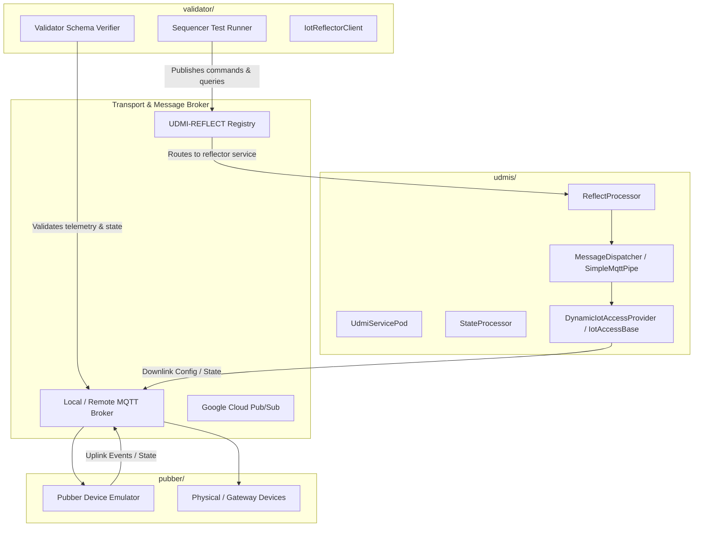

# UDMI Architecture & Major Components Guide

This guide maps the major functional pieces of the UDMI repository, their runtime responsibilities, and how to navigate across component boundaries during diagnosis.

---

## 1. System Landscape & Component Boundaries

UDMI is a distributed IoT schema, validation, and control system. Components interact across well-defined transport boundaries (MQTT, Cloud Pub/Sub, or local brokers):

---

## 2. The Major Pieces of UDMI

### 1. Sequencer (`validator/src/main/java/com/google/daq/mqtt/sequencer/`)
* **Role**: The automated integration test harness. It drives test sequences against target devices or cloud reflectors to verify compliance with UDMI feature specifications.
* **Key Files & Classes**:
  * `SequenceBase.java`: Base class for all test sequences, orchestrating test lifecycle, message wait queues, timeouts, and assertions.
  * `IotReflectorClient.java`: Client-side reflector proxy that sends commands to and receives responses from the cloud `UDMI-REFLECT` registry.
  * `sequences/*.java`: Test implementations grouped by bucket (`system`, `pointset`, `gateway`, `discovery`).

### 2. Validator (`validator/src/main/java/com/google/daq/mqtt/validator/`)
* **Role**: Validates received device messages (state, events, config) against authoritative JSON schemas.
* **Key Files & Classes**:
  * `Validator.java`: Core validation engine and error collector.
  * `ReportingDevice.java`: Tracks per-device compliance states, missing required fields, and schema violations.

### 3. UDMIS (`udmis/src/main/java/com/google/bos/udmi/service/`)
* **Role**: The backend distributed event processing pipeline and control plane microservices. When devices or sequencers interact with cloud endpoints, UDMIS processes, shards, routes, and records telemetry and state.
* **Key Subsystems**:
  * **Core Processors (`core/`)**:
    * `ReflectProcessor.java`: Handles reflector transactions sent to `UDMI-REFLECT`, querying and commanding devices on behalf of sequencers.
    * `StateProcessor.java`: Processes device state messages, validates against schemas, and updates datastores.
    * `TargetProcessor.java`: Routes commands and updates to target devices.
    * `ControlProcessor.java`: Handles control directives, heartbeats, and connection tracking.
  * **IoT Access Providers (`access/`)**:
    * `DynamicIotAccessProvider.java`: Dynamically resolves and caches downlink communication routes to target registries.
    * `IotAccessBase.java`: Base connection and session management across IoT providers (ClearBlade, GCP Pub/Sub, local MQTT).
  * **Messaging Pipeline (`messaging/`)**:
    * `MessageDispatcherImpl.java` & `SimpleMqttPipe.java` (in `messaging/impl/`): Asynchronous internal message dispatching, queue buffering, and transport piping.
  * **Pod & Container Launcher (`pod/`)**:
    * `UdmiServicePod.java` & `ContainerBase.java`: Entry point for launching UDMIS microservice pods and loading configuration.

### 4. Pubber (`pubber/src/main/java/`)
* **Role**: Synthetic device emulator that simulates real hardware behavior for testing and development.
* **Key Files & Classes**:
  * `daq/pubber/Pubber.java`: Device runtime entry point.
  * `daq/pubber/impl/manager/`: Component managers (`PubberPointsetManager.java`, `PubberGatewayManager.java`, `PubberSystemManager.java`).
  * `udmi/lib/base/`: MQTT connection encapsulation (`MqttDevice.java`, `MqttPublisher.java`).

### 5. Registrar
* **Role**: Site model synchronization and device provisioning tool.
* **Key Files & Classes**:
  * `validator/src/main/java/com/google/daq/mqtt/registrar/Registrar.java`: Synchronizes local site model device definitions with cloud registries (Cloud IoT Core, ClearBlade, or local brokers).
  * `services/src/main/java/com/google/daq/mqtt/registrar/RegistrarService.java`: Standalone service listening for repository push events to provision devices on the fly.

### 6. Common (`common/src/main/java/com/google/udmi/util/`)
* **Role**: Shared library of foundational data structures, utilities, and models used across all other components.
* **Key Files & Classes**:
  * `SiteModel.java`: Parses and validates site model folders, device metadata, and target connection specifications (`project_spec`).
  * `JsonUtil.java`: Authoritative JSON serialization and deserialization.

---

## 3. Cross-Service Exploration Principles ("Both Sides of the Wire")

When diagnosing communication errors, reflector failures, or unexpected timeouts:

1. **Every Message Has Two Ends**:
   * **Client / Caller Side**: Sends requests, awaits responses, manages caller timeouts (e.g. `validator/` or `pubber/`).
   * **Server / Processor Side**: Receives requests, queries devices or brokers, formats responses (e.g. `udmis/`).
2. **Never Treat Local Code as an External Black Box**:
   * When a client interacts with a service like `UDMIS` or a registry like `UDMI-REFLECT`, the backend code is **not** an opaque cloud service—its full implementation is in `udmis/`.
3. **Targeted Codebase Zooming**:
   * When searching for a concept across the repository, use `search_codebase` to view the `locations_summary`.
   * If matches appear in `udmis`, zoom in immediately using `search_codebase(query="...", path_prefix="udmis")` to inspect the backend processing logic.
   * If matches appear in `validator`, zoom in using `search_codebase(query="...", path_prefix="validator")`.
4. **Source Shows Intent; Logs Show Behavior**:
   * Client-side symptoms are directly observable through test artifacts, but backend behavior under load — queue depth, thread occupancy, connection churn — leaves no trace in the source.
   * Use `get_udmis_runtime_logs` to establish which tier of backend evidence exists for the incident:
     * `LOCAL_FILE`: Stack ran locally; local log file examined.
     * `CLOUD`: Stack ran against cloud services; logs retrieved from Cloud Logging.
     * `UNAVAILABLE`: Incident has outlived log retention window (no logs available). Reason from source with `RUNTIME_EVIDENCE: NONE (source inference only)`.
     * `INDETERMINATE`: Cloud log query failed to execute (e.g. tool or auth issue). Do NOT claim the logs expired or are unavailable. Reason from source with `RUNTIME_EVIDENCE: NONE (source inference only)` and declare the query failure.

---

## 4. Multi-Target Failure Scope Hierarchy

When triaging failures, use the number of affected targets to determine the investigation tier:

| Scope | Symptoms | Investigation Focus |
| :--- | :--- | :--- |
| **Tier 1: Single Device** | Only 1 device fails; other devices in the same site/target pass. | Inspect device metadata (`metadata.json`), pointset schemas, local hardware/sub-device proxy configuration. |
| **Tier 2: Total Outage** | All devices fail with hard connection refusals or authentication errors. | Inspect broker health, network connectivity, credentials/keys, target spec host and port. |
| **Tier 3: Multi-Target Degradation / Overload** | Multiple distinct devices experience intermittent 400s, 404s, slow responses, or reflector timeouts. | **Shared Infrastructure Contention**: the targets are independent, so suspect what they share rather than the targets themselves. Categories to consider:  • Throughput limits and backpressure • Concurrency, scheduling, and blocking • Resource lifecycle and reclamation • Shared mutable state and addressing |

Tier 3 categories are deliberately generic. Identify which apply by reading the
backend implementation for this repository at its current revision, and name the
specific components from what you find there. Do not assume a mechanism because the
category exists, and do not expect the responsible classes to match a previous
incident: this code changes.

