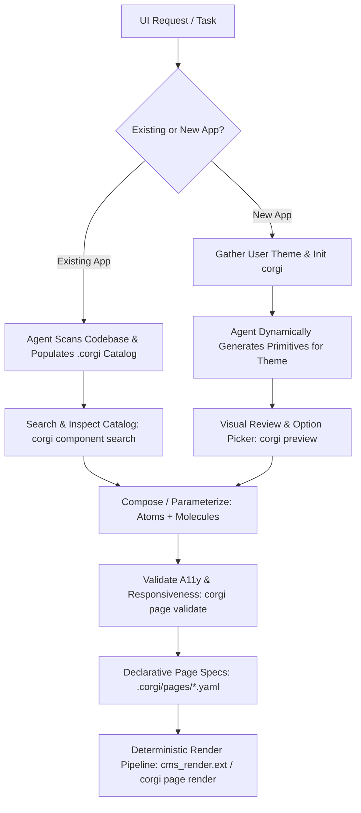

# CORGI: Catalog-driven Orchestration of Responsive Graphical Interfaces

CORGI provides a deterministic, catalog-driven framework for agentic UI/UX development.
It eliminates the core failure modes of AI-assisted frontend development:
**context tunnel-vision**, **silent visual regressions**, **inconsistent styling**,
**broken responsiveness**, and **accessibility blindspots**.



---

## Quick Start & CLI Setup

Define the `$CORGI` alias to execute CORGI commands:

```bash
# Run CORGI CLI directly via Python:
CORGI="python3 /google/src/cloud/heykhyati/create_curio_agentic_skill/configs/users/heykhyati/_agents/skills/corgi/scripts/corgi_cli.py"
```

Throughout this skill, invoke `$CORGI <subcommand>` to interact with the catalog and render pipeline.

---

## Core Mental Model: Agentic Reasoning vs. Deterministic Assembly

CORGI establishes a strict division of responsibility:

- **Agentic Responsibilities (Reasoning, Extraction & Design)**:
  The agent uses its semantic understanding of code (HTML, JSX, TSX, Soy, Jinja, CSS) to survey codebases, decompose UI trees into atomic primitives, identify dynamic parameters (`$name`, `$avatar_url`, `$designation`, `$script`, `$style`), write comprehensive component descriptions, and author declarative page specifications.
- **Deterministic Responsibilities (Compilation & Validation)**:
  Once component templates and YAML page configs exist, rendering them into the final webpage must be **100% deterministic** (`$CORGI page render` / `renderer.py`). This guarantees zero hallucination, zero accidental syntax mutation, and zero regressions across unrelated components as the codebase grows.

---

## Workflow 1: Existing Applications (Brownfield Living Design System)

For existing applications, `.corgi/` acts as the **Living Design System & Architectural Guide** for the agent:
- The existing codebase keeps its own build system, routing, and native rendering mechanisms (React, Angular, Django, Soy, etc.). The agent does **not** force an intrusive new render pipeline.
- Instead, the agent references `.corgi/catalog.json`, `theme.json`, and `layout.html` to understand existing component contracts, reusable atoms (buttons, badges, inputs), spacing tokens, and color variables.
- The agent then authors idiomatic, cohesive code directly into the existing codebase using those established patterns, completely eliminating visual fragmentation and regressions.

### Step 1: Agentic Codebase Survey
1. Initialize the `.corgi/` workspace:
   ```bash
   $CORGI init --path=.
   ```
2. The agent surveys all UI files across the project (`code_search`, `list_dir`, `view_file` for `.html`, `.jsx`, `.tsx`, `.vue`, `.soy`, `.jinja`, `.css`).
3. Identify the master layout, global styles, theme variables, fonts, navigation bar, and footer.
4. Extract and configure `.corgi/layout.html`, `.corgi/theme.json`, and `.corgi/assets.json`.

### Step 2: Semantic Component Decomposition & Extraction
The agent reads existing views and decomposes the UI into three clear tiers:
- **Structure (`.corgi/components/structure/`)**: Master grid systems, single/multi-column containers, hero banners, and section wrappers.
- **Atoms (`.corgi/components/atoms/`)**: Primitive building blocks — primary/secondary buttons, text inputs, dropdowns, pill badges, avatar icons, spans.
- **Molecules (`.corgi/components/molecules/`)**: Compound components combining multiple atoms (e.g. employee card with avatar, name, designation, and badge; stats widgets; navigation bars; modals).

### Step 3: Thorough Parameterization
For every extracted component, the agent replaces hardcoded text, names, images, URLs, and custom scripts/styles with clear placeholders:
- `${title}`, `${subtitle}`, `${body_text}`
- `${avatar_url}`, `${image_url}`, `${image_alt}`
- `${name}`, `${designation}`, `${team}`
- `${style}` (optional inline CSS overrides), `${script}` (optional scoped JS behavior)

Save each component to `.corgi/components/<category>/<component_id>.html`.

### Step 4: Catalog Registration
Register each component with its schema in `.corgi/catalog.json` using `$CORGI component add` or direct JSON:
```bash
$CORGI component add \
  --id="employee_card" \
  --category="molecule" \
  --name="Employee Profile Card" \
  --description="Displays employee avatar, name, designation, and department badge" \
  --file="components/molecules/employee_card.html" \
  --inputs='[{"name":"name","type":"string","default":"Jane Doe"},{"name":"avatar_url","type":"string","default":"/assets/avatar.png"},{"name":"designation","type":"string","default":"Staff SWE"},{"name":"team","type":"string","default":"Engineering"}]' \
  --tags="card,user,employee"
```

### Step 5: Cohesive Authoring
When modifying the existing app, use the catalog as a guide to ensure consistent styles, tokens, and reusable components.

---

## Workflow 2: New Applications (Greenfield Dynamic Generation)

When creating a new application or rapid prototype:

### Step 1: Discover User Theme & Initialize Workspace
1. Gather user preferences: color palette, typography, visual style (e.g. Clean SaaS, Dense Enterprise Dashboard, Editorial Portal), and density.
2. Initialize `.corgi/`:
   ```bash
   $CORGI init --path=. --theme_name="Company Portal" --primary_color="#1a73e8"
   ```
3. Update `.corgi/theme.json` and `.corgi/layout.html` with the chosen brand tokens and layout constraints.

### Step 2: Dynamically Generate the Core Starter Primitives
The agent dynamically authors and registers the required taxonomy of primitives styled to the user's theme:
- **Structure**: `single_column_container`, `two_column_grid`, `three_column_grid`, `hero_section`.
- **Atoms**: `primary_button`, `secondary_button`, `text_input`, `pill_badge`, `avatar_icon`, `heading_span`.
- **Molecules**: `profile_card`, `stats_card`, `spotlight_banner`, `navbar`, `footer`.

### Step 3: Visual Review & Option Picker
Launch the local preview server so the user can inspect and refine the generated theme:
```bash
$CORGI preview --port=3000
```
Navigate to `http://localhost:3000/catalog` to review rendered atomic components.

### Step 4: Declaratively Compose Pages
Create `.corgi/pages/home.yaml` referencing the registered components.

### Step 5: Framework-Specific Deterministic Render Function
For **any** language or framework chosen by the user (e.g. React/TypeScript `cms_render.tsx`, Dart `cms_render.dart`, Python `cms_render.py`, Go `cms_render.go`, Vue `cms_render.vue`, Svelte `cms_render.svelte`, Kotlin, etc.), the agent dynamically creates a native deterministic render module in `.corgi/` or the project source:
- The render module reads `.corgi/pages/*.yaml` and deterministically maps component IDs to native UI elements/widgets.
- This ensures the production app executes 100% deterministic UI assembly in its native language, while the CLI `$CORGI page render` provides instant standalone previewing.
- See [Framework-Specific Renderers](references/framework_renderers.md) for architectural patterns and reference implementations.

---

## Modifying UI: The Golden Catalog Lookup Rule

Whenever tasked with modifying or adding to the UI of any application:
1. **Always search the catalog first**:
   ```bash
   $CORGI component search "card"
   $CORGI component list --category=atom
   ```
2. **If an existing component matches**: Reuse it and supply parameters.
3. **If no direct composite exists**: Compose the new component using existing **atoms** (buttons, badges, inputs) and layout grids.
4. **If a new component is authored**: Immediately validate accessibility (`alt` tags, `aria-label`, semantic tags) and responsive breakpoints (`grid-cols-1 md:grid-cols-2`), then register it in `catalog.json`.
5. **Isolate changes to page configs**: Update `.corgi/pages/<page_name>.yaml`. Changes remain isolated, ensuring codebase stability as the project grows.

---

## CLI Command Reference

| Command | Description | Example |
| :--- | :--- | :--- |
| `corgi init` | Scaffolds `.corgi/` directory structure, theme tokens, and layout | `$CORGI init --path=. --primary_color="#1a73e8"` |
| `corgi component list` | Lists registered components by category (`atom`, `molecule`, `structure`) | `$CORGI component list --category=atom` |
| `corgi component add` | Registers a new or updated component in `.corgi/catalog.json` | `$CORGI component add --id=pill_badge --category=atom ...` |
| `corgi component get` | Displays details, parameter schema, and HTML source of a component | `$CORGI component get profile_card` |
| `corgi component search` | Searches catalog for matching components by keyword or tag | `$CORGI component search "button"` |
| `corgi page render` | Compiles declarative YAML page config into full HTML | `$CORGI page render .corgi/pages/home.yaml` |
| `corgi page validate` | Audits page config for missing components, a11y, and responsiveness | `$CORGI page validate .corgi/pages/home.yaml` |
| `corgi preview` | Starts local HTTP server for interactive catalog exploration | `$CORGI preview --port=3000` |

---

## Clean Component Interfaces & UI Observability

To guarantee that CORGI components never degrade into tightly coupled spaghetti code across any framework:

1. **Strict Presentation Purity (Zero Side-Effects in Catalog Components)**:
   - Catalog components (`atoms`, `molecules`, `organisms`, `structure`) are strictly presentational.
   - They must **never** perform network I/O (`fetch`, `EventSource`, `WebSocket`), directly mutate global application stores, or import route/service singletons.
   - All data enters exclusively via explicit, typed input props/parameters; all user interactions exit via semantic event callbacks (`onAction`, `onSelect`, `onToggle`).
2. **Observable Component Boundaries**:
   - Every interactive atom and molecule must include deterministic identification attributes (`data-corgi-component="<id>"` and `data-corgi-action="<action>"`) to enable structured UI interaction logging and automated end-to-end testing without brittle CSS selector coupling.
   - Error and loading states (`loading`, `error`, `empty`) must be explicit component variants rather than ad-hoc conditional markup scattered across parent views.

---

## Anti-Patterns to Avoid

- ❌ **Editing monolithic HTML files directly**: Mutating large view files causes silent visual breakages. Always decompose into components and edit declarative YAML page configs.
- ❌ **Hardcoding literal text/URLs in component source**: Hardcoding values destroys reusability. Use `${name}`, `${url}`, `${avatar_url}` placeholders.
- ❌ **Embedding network calls or business logic inside UI components**: Mixing API fetching or state store mutations inside presentational templates creates untestable spaghetti code. Keep I/O in dedicated service adapters.
- ❌ **Inventing new ad-hoc styles**: Avoid custom inline CSS when design tokens and existing atoms already provide standard styling.
- ❌ **Ignoring mobile breakpoints**: Never use hardcoded desktop widths (`w-[900px]`, `width: 900px`). Always use mobile-first responsive utilities (`w-full max-w-4xl px-4 md:px-8`).
- ❌ **Omitting accessibility attributes**: Never output `` without `alt` or icon-only buttons without `aria-label`.

---

## Detailed References

- [Catalog Schema Specification](references/catalog_schema.md): Complete schema for `catalog.json`, templates, and page YAMLs.
- [Framework-Specific Renderers](references/framework_renderers.md): Deterministic rendering patterns in React/TS, Dart, and Python.
- [Greenfield Workflow Guide](references/workflow_new_apps.md): Dynamic starter primitives generation, theme discovery, and CMS render pipeline.
- [Brownfield Agentic Scanning Guide](references/workflow_existing_apps.md): Step-by-step agentic codebase survey, component extraction, and cataloging.
- [Accessibility & Responsive Standards](references/a11y_and_responsiveness.md): WCAG 2.1 AA checklist and mobile-first design rules.
