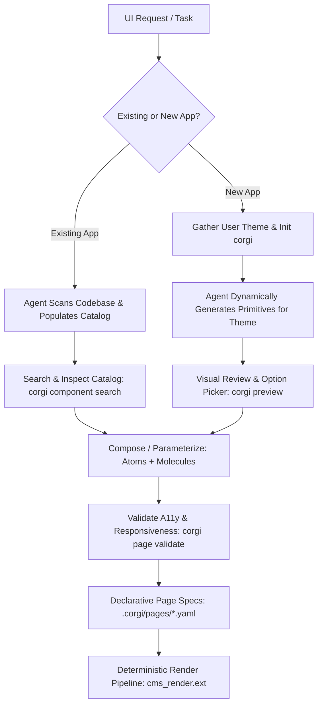

# CORGI: Catalog-driven Orchestration of Responsive Graphical Interfaces

go/corgi-ux

<!--* freshness: { owner: 'heykhyati' reviewed: '2026-08-21' } *-->

CORGI (**C**atalog-driven **O**rchestration of **R**esponsive **G**raphical **I**nterfaces) is an agentic UX development framework designed to eliminate the core failure modes of AI-assisted frontend development: **context tunnel-vision**, **silent visual regressions**, **inconsistent styling**, **broken responsiveness**, and **accessibility blindspots**.

By enforcing an **atomic design hierarchy**, a **centralized component catalog**, **declarative page configurations**, and **deterministic native rendering**, CORGI ensures that frontend codebases remain robust, cohesive, and maintainable across long-term agent interactions.

[TOC]

---

## The Paradigm Shift: From Sunk Cost to Disposable UI

As articulated in [A Vibrant Canvas: Developing UX Through Agentic Workflows](https://docs.google.com/document/d/1asdWyfxYshSnJBgFviDkz1n0Y0q-UscWXNXYB_CcWfc/edit), agentic workflows fundamentally transform the economics of UI design:

* **Traditional UX** relies on extensive specification and manual development, creating a strong "sunk cost bias" where teams defend suboptimal designs because rebuilding them requires significant engineering hours.
* **Agentic UX** enables continuous intent refinement:
  * **UI is Disposable**: Alternative concepts can be generated and discarded in seconds.
  * **Zero-Cost Pivots**: A single prompt or config change can test a radically different design paradigm (e.g. table layout to spatial canvas).
  * **Shift from Builder to Director**: When agents handle the implementation details, human expertise moves upstream to framing constraints, evaluating ergonomics, and validating user empathy.

However, as the speed of layout generation approaches zero, **the friction shifts entirely to coordination, consistency, and evaluation**. Without a structured framework, agentic development quickly succumbs to severe visual and architectural blindspots.



---

## The Problem Space: Agentic UX Blindspots & Failure Modes

Empirical observations documented in [Tryst with Agentic UX development](https://docs.google.com/document/d/1S_VL4V9q9Rn7TfFniM7bmbdxyIEzaADMTW9CRPLYqYg/edit) highlight four critical failure domains when AI models write frontend code without strict architectural guardrails.

CORGI was specifically designed to solve each of these failure modes:

```
┌────────────────────────────────────────────────────────────────────────────────────────┐
│                        AGENTIC FRONTEND FAILURE MODES & CORGI SOLUTIONS                │
├───────────────────────────────┬────────────────────────────────────────────────────────┤
│ Observed Challenge            │ CORGI Architectural Solution                           │
├───────────────────────────────┼────────────────────────────────────────────────────────┤
│ 1. Design Translation & Drift │ • Token-bound theme system (.corgi/theme.json)         │
│    • Communicating "vibes"    │ • Atomic primitive taxonomy (Structure, Atoms,         │
│    • Generic AI drift         │   Molecules) preventing styling hallucinations         │
│    • Uncontrolled hover/states│ • Pre-validated micro-interactions and focus states    │
│    • Responsive oversights    │ • Automated mobile-first viewport validation           │
├───────────────────────────────┼────────────────────────────────────────────────────────┤
│ 2. Prompting & Iteration Speed│ • Declarative YAML page specs (.corgi/pages/*.yaml)    │
│    • Brittle text prompts     │   decoupling page structure from markup                │
│    • Slow sequential turn-    │ • Local interactive Catalog Explorer (corgi preview)   │
│      arounds in chat UI       │   for rapid, parallel multi-option visual reviews      │
├───────────────────────────────┼────────────────────────────────────────────────────────┤
│ 3. Architecture & Code Quality│ • Living Design System Guide for brownfield apps       │
│    • Context tunnel-vision    │   (zero intrusive runtime injection)                   │
│    • Spaghetti state hacks    │ • Clean separation of UI presentation from state/APIs  │
│    • Backend tangling         │ • Automated XSS sanitization and strict parameter      │
│    • Performance bloat & XSS  │   substitution contracts (inputs_spec)                 │
├───────────────────────────────┼────────────────────────────────────────────────────────┤
│ 4. Validation, Testing & A11y │ • Automated WCAG 2.1 AA audits (corgi page validate)   │
│    • Silent visual regressions│ • Deterministic compilation (cms_render.ext) with 0%   │
│    • Accessibility blindspots │   runtime drift, eliminating fragile manual handoffs   │
│    • Fragile manual handoffs  │                                                        │
└───────────────────────────────┴────────────────────────────────────────────────────────┘
```

### 1. Design Translation & UI Consistency
* **The Problem**: Communicating aesthetics and typography purely via text prompts is imprecise. Without explicit constraints, LLMs default to generic, unbranded styles, invent inconsistent micro-interactions (new loading spinners, arbitrary easing curves), and hardcode fixed pixel widths (`width: 800px`, `w-[900px]`) because vision models evaluate layouts on a single viewport, silently breaking mobile and tablet breakpoints.
* **CORGI's Fix**: Maintains an explicit design token file (`.corgi/theme.json`) and shared atomic primitives (`.corgi/components/atoms/`). All components are audited against mobile-first responsive constraints via `corgi page validate`.

### 2. Prompting Friction & Iteration Speed
* **The Problem**: As codebases grow, prompts become brittle; slight phrasing differences cause unintended visual side effects. Relying on conversational chat turns forces slow sequential evaluation rather than evaluating multiple design options in parallel.
* **CORGI's Fix**: Page configurations are abstracted into clean, declarative YAML files (`.corgi/pages/*.yaml`). Designers and engineers can visually inspect and compare all components simultaneously using the local live explorer (`corgi preview`).

### 3. Architecture, State, & Code Quality
* **The Problem**: When LLMs focus on a single file, they suffer from **context tunnel-vision**, losing sight of the global architecture and breaking dependent views. To make prototypes work quickly, agents frequently inject localized "spaghetti state" hacks rather than respecting global state management, entangle UI exploration with backend APIs, bloat bundle sizes with heavy third-party dependencies, and introduce XSS vulnerabilities (e.g. unsanitized `dangerouslySetInnerHTML`).
* **CORGI's Fix**: In brownfield apps, `.corgi/` acts as an architectural guide, preventing changes from polluting the existing codebase. UI presentation is cleanly decoupled from backend logic, and parameter substitution is strictly enforced through typed `inputs_spec` contracts.

### 4. Validation, Testing, & Handoff
* **The Problem**: Lack of automated regression checks means layout shifts go unnoticed. Vision models focus on pixels rather than semantic structure, outputting markup missing ARIA attributes, labels, and keyboard navigation. Moving from prototype to production code is a fragile, error-prone manual process.
* **CORGI's Fix**: Automated WCAG 2.1 AA validation (`corgi page validate`) catches accessibility and markup errors before code is committed. Native framework render modules (`cms_render.tsx`, `cms_render.dart`, `cms_render.py`) make production compilation 100% deterministic with zero manual handoff friction.

---

## Core Mental Model: Agentic Reasoning vs. Deterministic Assembly

CORGI establishes a strict division of responsibility:

### 1. Agentic Responsibilities (Reasoning & Synthesis)
- **Codebase Survey & Discovery**: Survey existing templates (`.html`, `.jsx`, `.tsx`, `.vue`, `.soy`, `.jinja`, `.css`) using code search and file inspection.
- **Semantic Component Decomposition**: Decompose user interfaces into three standardized tiers (Structure, Molecules, Atoms).
- **Parameter Extraction**: Replace hardcoded values with clear dynamic placeholders (`${name}`, `${avatar_url}`, `${designation}`, `${style}`, `${script}`).
- **Theme Synthesis**: Extract global layouts, CSS custom properties, and typography into `.corgi/layout.html` and `.corgi/theme.json`.
- **Declarative Page Transcription**: Transcribe views into clean, decoupled `.corgi/pages/*.yaml` configuration files.

### 2. Deterministic Responsibilities (Compilation & Verification)
- **Catalog Management**: Indexed metadata, parameter schemas, and category tags stored in `.corgi/catalog.json`.
- **Deterministic Page Assembly**: Native render modules (`cms_render.tsx`, `cms_render.dart`, `cms_render.py`) deterministically compile YAML page trees into UI elements with 0% risk of LLM hallucinations or syntax drift.
- **Contract & A11y Auditing**: Automated validation of missing parameters, orphaned components, missing image `alt` attributes, and non-responsive CSS width rules via `corgi page validate`.
- **Local Live Explorer**: Real-time component catalog inspection and interactive page previews via `corgi preview`.

---

## Component Taxonomy Hierarchy

CORGI organizes all UI elements into three standardized tiers within `.corgi/components/`:

```
.corgi/
├── catalog.json                                # Master component registry & parameter schemas
├── layout.html                                 # Global page layout & head metadata
├── theme.json                                  # Design tokens (colors, typography, radii)
├── assets.json                                 # Static assets & external font references
├── components/
│   ├── structure/                              # Grids, hero sections, container wrappers
│   ├── atoms/                                  # Buttons, text inputs, pill badges, icons
│   └── molecules/                              # Profile cards, stats cards, navbars, footers
└── pages/
    └── home.yaml                               # Declarative page specification
```

### 1. Structure (`components/structure/`)
Defines the spatial architecture and layout grid:
- `single_column_container.html`: Responsive centered content wrapper (`max-w-7xl mx-auto px-4 sm:px-6 lg:px-8`).
- `two_column_grid.html`: Fluid 2-column layout (`grid grid-cols-1 md:grid-cols-2 gap-6`).
- `three_column_grid.html`: Fluid 3-column layout (`grid grid-cols-1 sm:grid-cols-2 lg:grid-cols-3 gap-6`).
- `hero_section.html`: Header banner with `${title}`, `${subtitle}`, `${badge}`, and `${cta_button}` hooks.

### 2. Atoms (`components/atoms/`)
Indivisible UI building blocks:
- `primary_button.html` & `secondary_button.html`: Interactive actions styled with theme tokens, hover transitions, and focus rings (`${label}`, `${url}`).
- `text_input.html`: Accessible form field with `<label>`, placeholder, and focus states (`${label}`, `${input_id}`, `${placeholder}`, `${value}`).
- `pill_badge.html`: Category/status indicator pill (`${text}`).
- `avatar_icon.html`: Rounded user avatar image or icon placeholder (`${avatar_url}`, `${alt_text}`).

### 3. Molecules (`components/molecules/`)
Compound units combining multiple atoms and structural blocks:
- `profile_card.html`: Combines avatar, name, designation, and department badge (`${avatar_url}`, `${name}`, `${designation}`, `${team}`).
- `stats_card.html`: Metric/KPI card displaying numeric metric, trend badge, and label (`${metric_label}`, `${metric_value}`, `${change_badge}`, `${metric_description}`).
- `spotlight_banner.html`: Feature callout card with headline, body text, and embedded CTA button.
- `navbar.html`: Header navigation bar with brand icon, title, and nav links (`${brand_icon}`, `${brand_name}`, `${nav_links}`, `${right_action}`).
- `footer.html`: Responsive footer with links and copyright notice (`${copyright_owner}`, `${privacy_url}`, `${terms_url}`, `${contact_url}`).

---

## Development Workflows

### Greenfield Workflow: New Applications

1. **Discover User Theme**: The agent asks or infers the user's design preferences (primary color, typography, light/dark vibe, density).
2. **Initialize Workspace**:
   ```bash
   corgi init --path=. --theme_name="Fleet Portal" --primary_color="#1a73e8"
   ```
3. **Dynamically Generate Starter Primitives**: The agent authors and parameterizes the core taxonomy of primitives in `.corgi/components/`, styling them to match the chosen theme.
4. **Register in Catalog**:
   ```bash
   corgi component add --id="primary_button" --category="atom" --name="Primary Button" --file="components/atoms/primary_button.html" --inputs='[{"name":"label","type":"string","default":"Submit"},{"name":"url","type":"string","default":"#"}]'
   ```
5. **Interactive Preview**: Launch `corgi preview --port=3000` so the user can visually review and refine their tailored theme.
6. **Compose Pages Declaratively**: Author `.corgi/pages/home.yaml` referencing registered component IDs.

### Brownfield Workflow: Existing Applications (Living Design System Guide)

In existing applications, `.corgi/` acts as the **Living Design System & Architectural Guide** for the Agent:
- The existing codebase retains its native build system, routing, and rendering mechanism (React, Angular, Django, Soy, etc.). The Agent does **not** force an intrusive new runtime.
- The Agent references `.corgi/catalog.json`, `theme.json`, and `layout.html` to understand existing component contracts, reusable atoms (buttons, badges, inputs), spacing tokens, and color variables.
- The Agent then authors cohesive, idiomatic code directly into the existing codebase using those established patterns.

1. **Agentic Codebase Survey**: Use code search to locate all frontend templates across the repository.
2. **Extract Layout & Tokens**: Extract the master layout into `.corgi/layout.html` and design tokens into `.corgi/theme.json`.
3. **Decompose UI into 3-Tier Taxonomy**: Extract repeating grids, compound cards, and atomic buttons/inputs into `.corgi/components/`.
4. **Parameterize Templates**: Replace dynamic values with `${name}`, `${avatar_url}`, `${designation}`, `${style}`, `${script}` placeholders.
5. **Register in Catalog**: Register schemas in `.corgi/catalog.json` so future agent modifications reuse established atoms.
6. **Cohesive Authoring**: Use the catalog as a guide when modifying or adding UI features to the existing codebase.

---

## Framework-Specific Deterministic Renderers

While the `.corgi/` catalog and page YAMLs are language-agnostic data contracts, the **production render function is written natively in your application's programming language**.

| Target Stack | Render Module | How It Works |
| :--- | :--- | :--- |
| **React / Next.js / TypeScript** | `cms_render.tsx` | Maps `component_id` to a typed React Component registry: `<Component {...params} />` |
| **Dart / Flutter / AngularDart** | `cms_render.dart` | A factory switch / builder that maps `component_id` to native Dart Widgets / Angular elements |
| **Python / Flask / Soy** | `cms_render.py` | String & template substitution with Soy sanitization |
| **Go** | `cms_render.go` | Compiles into `html/template` pipeline |
| **Vue / Svelte / Kotlin** | `cms_render.<ext>` | Native dynamic component loader / renderer |

---

## Using CORGI in Jetski

Jetski discovers and loads CORGI through Google3's standard customization system.

### 1. Activating CORGI in Chat
Because CORGI is registered with progressive disclosure, you can activate it by mentioning it in your prompts:

- **New App Prototype**:
  > *"Use the corgi skill to initialize a new web portal with a modern dark theme and primary color #0b57d0."*
- **Existing App Onboarding**:
  > *"Please use corgi to scan our codebase under `//path/to/ui`, extract reusable components into `.corgi/catalog.json`, and set up page configs."*
- **Adding Features**:
  > *"Add a new employee directory page using existing cards and atoms from our `.corgi/` catalog."*
- **Auditing Quality**:
  > *"Validate all `.corgi/pages/` for WCAG 2.1 AA accessibility and mobile responsiveness."*

### 2. Enabling CORGI Across Your Workspaces

To ensure CORGI is always available across all your CitC clients, register it in your personal Jetski configuration:

#### Option A: Personal Global Config (`~/.gemini/config/skills.json`)
```json
{
  "skills": [
    "configs/users/heykhyati/_agents/skills/corgi"
  ]
}
```

#### Option B: Personal Piper Config (`configs/users/%USERNAME%/_agents/skills.json`)
```json
{
  "skills": [
    "configs/users/heykhyati/_agents/skills/corgi"
  ]
}
```

#### Option C: Team / Project Directory Config
Add a `skills.json` or mention `corgi` in your project's `AGENTS.md` or `GEMINI.md`:
```markdown
# Team Agent Guidelines
Always use the CORGI skill (configs/users/heykhyati/_agents/skills/corgi) when creating or modifying frontend components and page layouts.
```

### 3. Local CLI Build & Preview
You can also run the CORGI CLI directly in your terminal:

```bash
# Define alias
CORGI="python3 /google/src/cloud/heykhyati/create_curio_agentic_skill/configs/users/heykhyati/_agents/skills/corgi/scripts/corgi_cli.py"

# Launch the live interactive Catalog Explorer
$CORGI preview --port=3000
```
Open `http://localhost:3000/catalog` to inspect registered components.

---

## CORGI CLI Reference

The CORGI CLI provides command-line tooling for workspace management and verification:

| Command | Description | Example |
| :--- | :--- | :--- |
| `corgi init` | Scaffolds `.corgi/` directory structure, theme tokens, and layout | `$CORGI init --path=. --primary_color="#1a73e8"` |
| `corgi component list` | Lists registered components by category (`atom`, `molecule`, `structure`) | `$CORGI component list --category=atom` |
| `corgi component add` | Registers a new or updated component in `.corgi/catalog.json` | `$CORGI component add --id=pill_badge --category=atom ...` |
| `corgi component get` | Displays details, parameter schema, and HTML source of a component | `$CORGI component get profile_card` |
| `corgi component search` | Searches catalog for matching components by keyword or tag | `$CORGI component search "button"` |
| `corgi page render` | Compiles declarative YAML page config into full HTML | `$CORGI page render .corgi/pages/home.yaml` |
| `corgi page validate` | Audits page config for missing components, a11y, and responsiveness | `$CORGI page validate .corgi/pages/home.yaml` |
| `corgi preview` | Starts local HTTP server for interactive catalog exploration | `$CORGI preview --port=3000` |

---

## Accessibility & Responsiveness Guardrails

CORGI enforces strict quality checks on all components:

- **WCAG 2.1 AA Accessibility**:
  - Images **must** have explicit `alt` attributes (``).
  - Buttons and anchors **must** contain visible text or an explicit `aria-label`.
  - Form inputs **must** have associated `<label>` tags with matching `for`/`id` attributes.
  - Interactive elements **must** define clear `:focus-visible` or `focus:ring-2` focus rings.
- **Mobile-First Responsiveness**:
  - Hardcoded desktop pixel widths (e.g. `width: 900px`, `w-[900px]`) are strictly prohibited.
  - Multi-column grids must use mobile-first responsive breakpoints (e.g. `grid grid-cols-1 md:grid-cols-2 lg:grid-cols-3`).
  - Layout containers must use fluid max-width constraints (e.g. `max-w-7xl w-full mx-auto px-4 sm:px-6 lg:px-8`).

---

## Key Anti-Patterns to Avoid

- ❌ **Hardcoding fixed starter templates**: Never force a generic color scheme on the user. Always generate starter components aligned with the user's theme and brand.
- ❌ **Editing monolithic view files directly**: Mutating large view files leads to silent visual breakages. Always decompose into components and edit declarative YAML page configs.
- ❌ **Hardcoding literal text/URLs in component source**: Hardcoding values destroys reusability. Use `${name}`, `${url}`, `${avatar_url}` placeholders.
- ❌ **Inventing new ad-hoc styles**: Avoid custom inline CSS when design tokens and existing atoms already provide standard styling.
- ❌ **Ignoring mobile breakpoints**: Never use hardcoded desktop widths (`w-[900px]`, `width: 900px`). Always use mobile-first responsive utilities (`w-full max-w-4xl px-4 md:px-8`).
- ❌ **Omitting accessibility attributes**: Never output `` without `alt` or icon-only buttons without `aria-label`.

---

## Related Documents & Background Reading

- [A Vibrant Canvas: Developing UX Through Agentic Workflows](https://docs.google.com/document/d/1asdWyfxYshSnJBgFviDkz1n0Y0q-UscWXNXYB_CcWfc/edit): Core architectural vision, the disposable UI paradigm, and multi-agent interaction loops.
- [Tryst with Agentic UX development](https://docs.google.com/document/d/1S_VL4V9q9Rn7TfFniM7bmbdxyIEzaADMTW9CRPLYqYg/edit): Detailed breakdown of empirical challenges, blindspots, and failure modes in AI-assisted frontend engineering.
- [CORGI Skill Instructions](SKILL.md): Master instructions file for Jetski agents.
- [Catalog Schema Specification](references/catalog_schema.md): Complete schema for `catalog.json`, templates, and page YAMLs.
- [Framework-Specific Renderers](references/framework_renderers.md): Deterministic rendering patterns in React/TS, Dart, Python, and universal stacks.
- [Greenfield Workflow Guide](references/workflow_new_apps.md): Dynamic starter primitives generation, theme discovery, and CMS render pipeline.
- [Brownfield Agentic Scanning Guide](references/workflow_existing_apps.md): Step-by-step agentic codebase survey, component extraction, and cataloging.
- [Accessibility & Responsive Standards](references/a11y_and_responsiveness.md): WCAG 2.1 AA checklist and mobile-first design rules.
