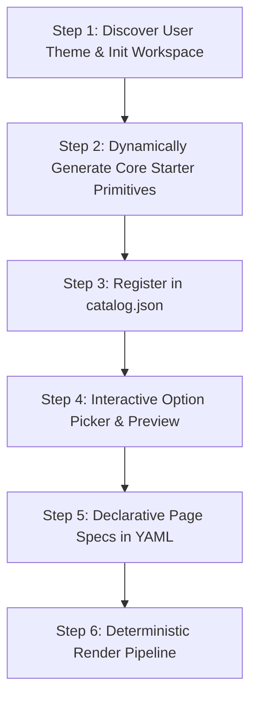

# Greenfield Workflow: Scaffolding & Dynamic Starter Primitives

When building a new application from scratch, agents have the opportunity to establish a **deterministic, contract-driven architecture** from day one.

Rather than relying on rigid, pre-baked starter templates that clash with the user's intended aesthetic, CORGI instructs the agent to **dynamically generate the core taxonomy of starter primitives tailored specifically to the user's requested theme, branding, and design tokens**.

---

## The Greenfield Development Lifecycle



---

### Step 1: Discover User Theme & Initialize Workspace

1. Understand the user's intended visual aesthetic:
   - Primary and secondary brand colors.
   - Typography (e.g. Google Sans, Roboto, Inter, serif/sans-serif).
   - Theme style (e.g. Modern Clean SaaS, High-Density Enterprise Dashboard, Minimalist Portal, Dark/Light mode).
   - Component corner rounding (pill, rounded-2xl, sharp).

2. Initialize the workspace:
   ```bash
   corgi init --path=. --theme_name="Fleet Management" --primary_color="#0b57d0"
   ```

3. Update `.corgi/theme.json` with the exact design tokens matching the user's aesthetic.

---

### Step 2: Dynamically Generate the Core Starter Primitives

The agent dynamically authors and parameterizes each of the following required primitives in `.corgi/components/`:

#### 1. Structure (`.corgi/components/structure/`)
- `single_column_container.html`: Responsive centered container (`max-w-7xl mx-auto px-4 sm:px-6 lg:px-8`).
- `two_column_grid.html`: Fluid 2-column grid (`grid grid-cols-1 md:grid-cols-2 gap-6`).
- `three_column_grid.html`: 3-column layout (`grid grid-cols-1 sm:grid-cols-2 lg:grid-cols-3 gap-6`).
- `hero_section.html`: Hero banner layout with `${title}`, `${subtitle}`, `${badge}`, and `${cta_button}` placeholders.

#### 2. Atoms (`.corgi/components/atoms/`)
- `primary_button.html`: Main action button styled with the user's primary color, focus rings, hover transition (`${label}`, `${url}`).
- `secondary_button.html`: Secondary outlined/subtle button (`${label}`, `${url}`).
- `text_input.html`: Accessible input with `<label>`, placeholder, focus state (`${label}`, `${input_id}`, `${placeholder}`, `${value}`).
- `pill_badge.html`: Rounded status/tag pill matching the theme palette (`${text}`).
- `avatar_icon.html`: Rounded user avatar or icon container (`${avatar_url}`, `${alt_text}`).

#### 3. Molecules (`.corgi/components/molecules/`)
- `profile_card.html`: User card combining avatar, name, designation, and team badge (`${avatar_url}`, `${name}`, `${designation}`, `${team}`).
- `stats_card.html`: Metric/KPI card displaying numeric value, label, and status badge (`${metric_label}`, `${metric_value}`, `${change_badge}`, `${metric_description}`).
- `spotlight_banner.html`: Callout banner with headline, description, and action button (`${badge_text}`, `${headline}`, `${description}`, `${action_button}`).
- `navbar.html`: Header navigation with logo, brand title, links, and action button (`${brand_icon}`, `${brand_name}`, `${nav_links}`, `${right_action}`).
- `footer.html`: Responsive footer with links and copyright (`${copyright_owner}`, `${privacy_url}`, `${terms_url}`, `${contact_url}`).

---

### Step 3: Register in `catalog.json`

For each generated component, save its file and register its parameters in `.corgi/catalog.json`:

```bash
corgi component add \
  --id="profile_card" \
  --category="molecule" \
  --name="User Profile Card" \
  --file="components/molecules/profile_card.html" \
  --inputs='[{"name":"name","type":"string","default":"Jane Doe"},{"name":"avatar_url","type":"string","default":"/assets/avatar.png"},{"name":"designation","type":"string","default":"Staff SWE"},{"name":"team","type":"string","default":"Floe"}]' \
  --tags="card,user,profile"
```

---

### Step 4: Interactive Option Picker & Review

Start the preview server to let the user visually inspect all generated components:

```bash
corgi preview --port=3000
```
Navigate to `http://localhost:3000/catalog` to review and refine the theme styling.

---

### Step 5: Declarative Page Composition

Compose pages declaratively in `.corgi/pages/<slug>.yaml`:

```yaml
page_id: home
title: Team Portal
layout_id: default
components:
  - component_id: hero_section
    params:
      title: "Welcome to Our Platform"
      subtitle: "Deterministic, cohesive, and accessible user interfaces."
      badge:
        component_id: pill_badge
        params:
          text: "v1.0"
      cta_button:
        component_id: primary_button
        params:
          label: "Get Started"
          url: "/start"

  - component_id: two_column_grid
    params:
      col_content:
        - component_id: profile_card
          params:
            name: "Khyati Mahendru"
            avatar_url: "https://lh3.googleusercontent.com/a/default"
            designation: "Staff SWE"
            team: "Floe Agents"
```

---

### Step 6: Deterministic Render Pipeline

Compile pages to production HTML:

```bash
corgi page render .corgi/pages/home.yaml --output=./dist/index.html
```

Or write the native deterministic render module in the target language (e.g. `cms_render.tsx` for React, `cms_render.dart` for Dart, `cms_render.py` for Python).
